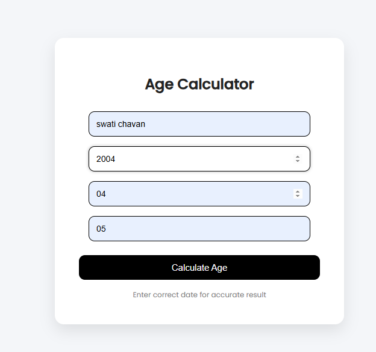

#  Age Calculator Web Application

## Project Description
This is a simple web-based Age Calculator developed using JSP and HTML.  
The application takes user input such as name and date of birth, and calculates:

- Current age in years
- Day of the week the user was born

---

##  Technologies Used
- HTML
- CSS
- JSP (Java Server Pages)
- Apache Tomcat Server
- Java (java.time package)

---

##  Input
The user enters:
- Name
- Birth Year
- Birth Month
- Birth Day

---

## Output
The application displays:
- User's Name
- Calculated Age
- Day of Birth (e.g., MONDAY)
- Date of Birth

---

##  Features
- Clean and professional UI design
- Input validation (error handling)
- UTF-8 encoding support (emoji compatible 👋)
- Responsive layout
- Easy navigation (Back button)
- 

##  How to Run

1. Install Apache Tomcat Server
2. Place project folder inside:
   apache-tomcat/webapps/
3. Start Tomcat server
4. Open browser and go to:
   http://localhost:8080/myproject/index.jsp

---

---

## ✅ Conclusion
This project demonstrates the use of JSP and Java for building dynamic web applications with user input processing and clean UI design.
